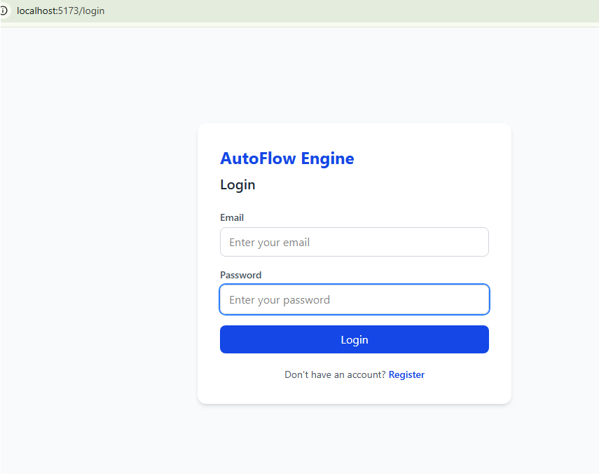
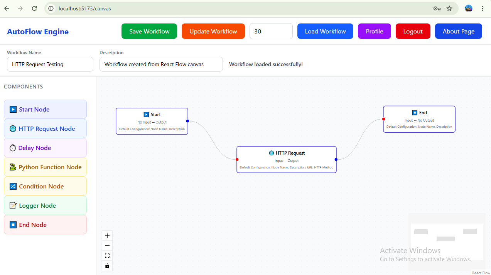
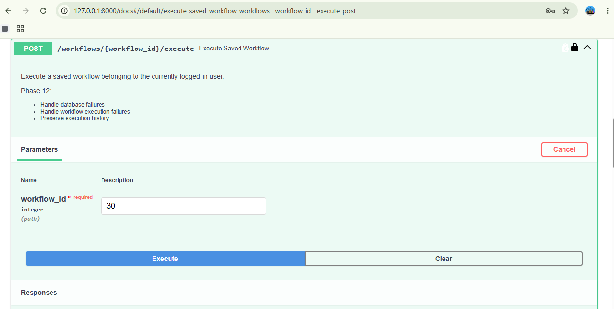
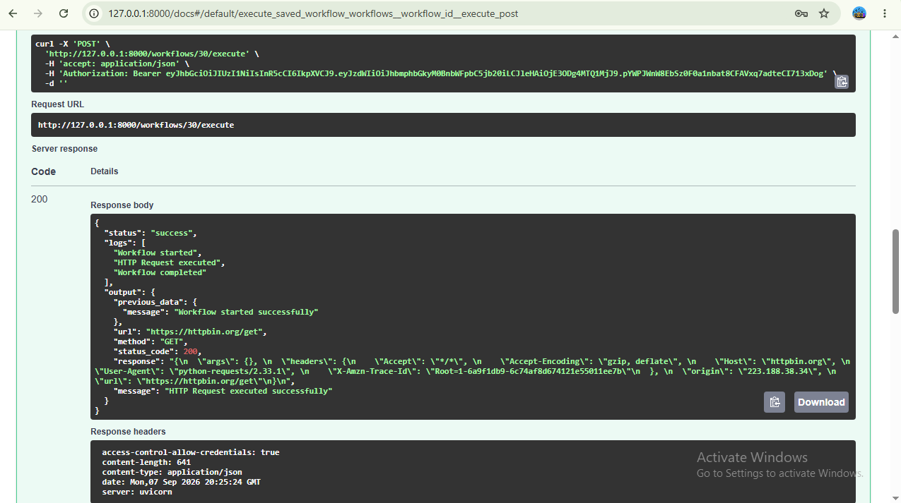

# AutoFlow Engine
### A Python-Based Drag & Drop Workflow Automation Platform

A full-stack Python-Based Drag & Drop Workflow Automation Platform built with FastAPI (Backend) and React Flow (Frontend). Users can create, save, execute, and monitor custom multi-step node-based workflows.

---

## Installation Guide

### Prerequisites
* Python 3.10 or higher
* Node.js v18 or higher
* npm or yarn package manager

### 1. Backend Setup

Navigate to the `backend` directory and set up the environment:

```bash
cd backend

# Create virtual environment
python -m venv venv

# Activate virtual environment
# On Windows:
venv\Scripts\activate
# On macOS/Linux:
source venv/bin/activate

# Install dependencies
pip install -r requirements.txt

```

Set up environment variables in a `.env` file inside `backend/`:

```env
DATABASE_URL=sqlite:///./automation.db
SECRET_KEY=your_secret_key_here
ALGORITHM=HS256
ACCESS_TOKEN_EXPIRE_MINUTES=30

```

Run Alembic database migrations:

```bash
alembic upgrade head

```

Start the backend FastAPI server:

```bash
uvicorn main:app --reload

```

The FastAPI server will start at `http://127.0.0.1:8000`.

---

### 2. Frontend Setup

Navigate to the `frontend` directory and install dependencies:

```bash
cd frontend

# Install packages
npm install

# Start Vite development server
npm run dev

```

The React frontend will be accessible at `http://localhost:5173`.

---

## Project Architecture

```text
+-------------------------------------------------------+
|                    React Frontend                     |
|  (React Flow Canvas, App.jsx, CustomNode Components)  |
+---------------------------+---------------------------+
                            |
                     REST API / JSON
                            |
v                           v
+-------------------------------------------------------+
|                    FastAPI Backend                    |
| (Authentication, Workflow Routes, Schemas Validation) |
+---------------------------+---------------------------+
                            |
           +----------------+----------------+
           |                                 |
v          v                                 v
+-----------------------+        +----------------------+
| SQLite Database       |        | Execution Engine     |
| (SQLAlchemy Models &  |        | (Node Parsing & Step |
|  Alembic Migrations)  |        |  by Step Execution)  |
+-----------------------+        +----------------------+

---
```

## API Documentation

### General Endpoints

| Method |  Endpoint   |         Description            |
| -----  | ----------- | ------------------------------ |
| `GET`  | `/api/data` | Fetch general application data |

### Authentication & User Endpoints

| Method |  Endpoint   |             Description                       |
| ------ | ----------- | --------------------------------------------- |
| `POST` | `/register` | Register a new user account                   |
| `POST` | `/login`    | Authenticate user and return JWT access token |
| `GET`  | `/profile`  | Get logged-in user profile details            |

### Workflow Endpoints
 
| Method   |           Endpoint                    |               Description                     |
| -------- | ------------------------------------- | --------------------------------------------- |
| `GET`    | `/workflows`                          | List all workflows created by the user        |
| `POST`   | `/workflows`                          | Create and save a new workflow                |
| `GET`    | `/workflows/{workflow_id}`            | Retrieve specific workflow details by ID      |
| `PUT`    | `/workflows/{workflow_id}`            | Update an existing workflow by ID             |
| `DELETE` | `/workflows/{workflow_id}`            | Delete a workflow by ID                       |
| `POST`   | `/workflows/{workflow_id}/execute`    | Execute a saved workflow via execution engine |
| `GET`    | `/workflows/{workflow_id}/executions` | Get execution history and logs for a workflow |

---


## Folder Structure

```text
my-fullstack-app/
│
├── backend/
│   ├── migrations/             # Alembic migration scripts and history
│   ├── auth.py                 # JWT token generation & password hashing
│   ├── database.py             # SQLAlchemy DB session setup
│   ├── execution_engine.py     # Core workflow node processor
│   ├── main.py                 # FastAPI application routes & entrypoint
│   ├── models.py               # Database tables (User, Workflow, Execution)
│   ├── schemas.py              # Pydantic data validation schemas
│   ├── alembic.ini             # Alembic configuration file
│   └── requirements.txt        # Python backend dependencies
│
└── frontend/
    ├── public/                 # Static assets and icons
    ├── src/
    │   ├── assets/             # Images and SVG assets
    │   ├── components/
    │   │   └── CustomNode.jsx  # Custom React Flow canvas node design
    │   ├── App.jsx             # Main UI canvas and app control logic
    │   ├── App.css             # Frontend component styling
    │   ├── index.css           # Tailwind CSS imports
    │   └── main.jsx            # React root component entry
    ├── package.json            # Node.js dependencies and scripts
    ├── tailwind.config.js      # Tailwind CSS configuration
    └── vite.config.js          # Vite build tool configuration


---
```

## Workflow Engine Design

The workflow engine (`execution_engine.py`) processes node-graph representations built on the frontend.

* **Graph Parsing:** Reads nodes and edge connections sequentially to determine step ordering.
* **Node Execution:** Iterates through supported block types (Triggers, Actions, Conditions).
* **Error Handling:** Traps exceptions during step execution, updates execution status (`SUCCESS` / `FAILED`), and records error details in the database.
* **Logging:** Persists execution logs with execution timestamp and status back to SQLite.

---

## Screenshots

`frontend/public/screenshots/`:

* **`Authentication (auth-screen.png):`** Login and Registration interface for secure user access.
* **`Workflow Canvas (canvas-view.png):`** Drag-and-drop React Flow canvas with custom nodes for building workflows.
* **`Execution & Logs (workflow-execution.png):`** Live execution status and JSON response logs showing step-by-step workflow output.







---

## Future Improvements

* Multi-tenant role-based access control (RBAC).
* Real-time WebSocket updates during workflow execution.
* Asynchronous task queues using Celery and Redis.
* Webhook trigger integration for third-party service connections.

